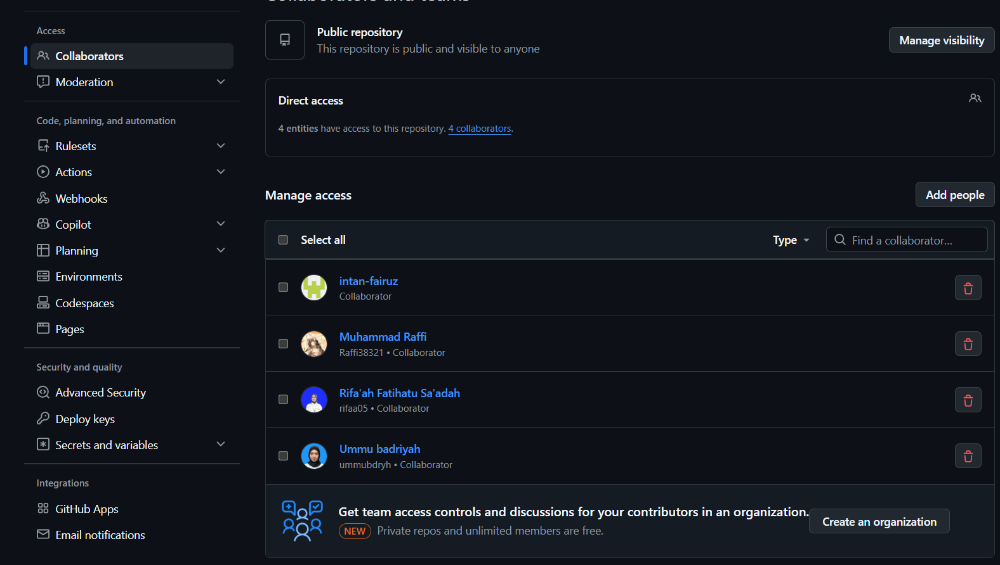
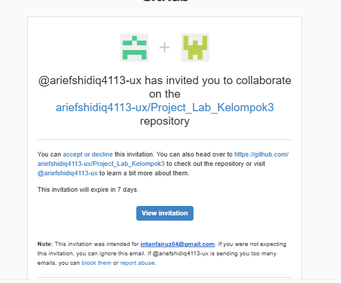
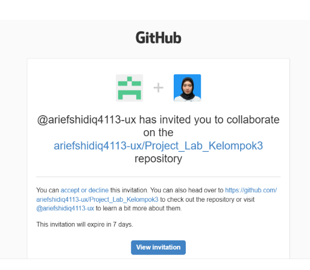

### Proses Pengembangan Project Lab Kelompok3 ###
Anggota Kelompok:
1. Muhammad 'Arif Nur Shidiq_2488010022
2. Muhammad Raffi_2488010046
3. Intan Fairuz Nur Asiyah_2488010005
4. Ummu Badriyah Mualifah_2488010082
5. Rifa'ah Fatihatu Sa'adah_2488010008

# Progres Pengembangan 1(Pertemuan 5) #
1. Tugas Ketua Kelompok(Muhammad 'Arif Nur Shidiq)
    - Inisiasi Project dan Invite Member
    
    - Create Project (npx create-expo-app@latest)
    <video controls src="Recording-2026-10-01-095141.mp4" title="Title"></video>
2. Tugas Anggota Kelompok
    - accept member
     Nama: Muhammad Raffi - 2488010046
     
    

    ========
    Nama: Intan Fairuz Nur Asiyah - 2488010005

    

    Nama: Ummu Badriyah Mualifah - 2488010082

    
    - clone project